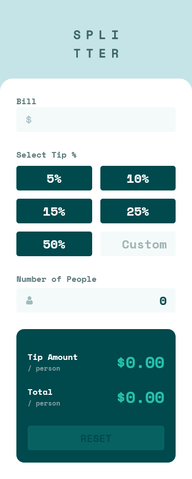
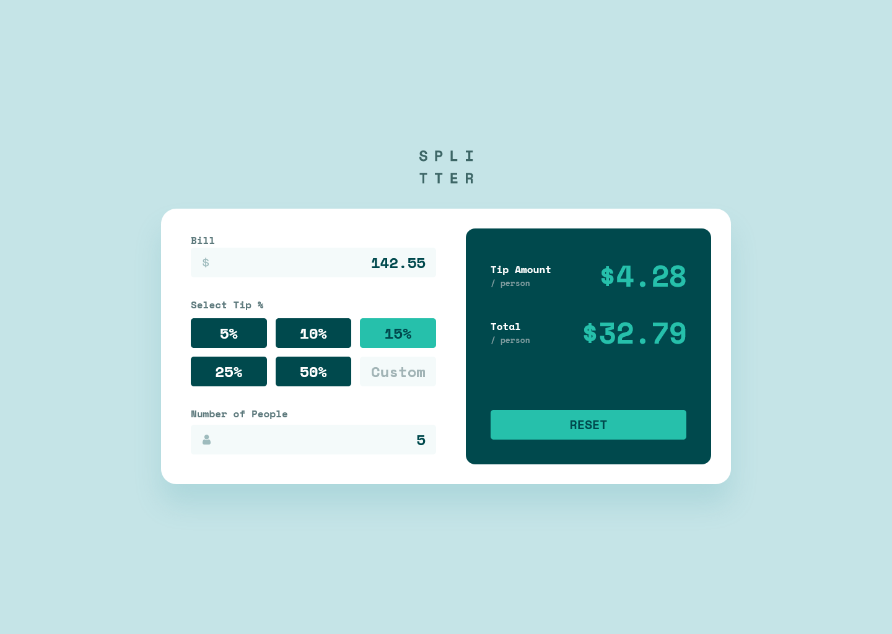

# Frontend Mentor - Tip calculator app solution

This is a solution to the [Tip calculator app challenge on Frontend Mentor](https://www.frontendmentor.io/challenges/tip-calculator-app-ugJNGbJUX). Frontend Mentor challenges help you improve your coding skills by building realistic projects.

## Table of contents

- [Overview](#overview)
  - [The challenge](#the-challenge)
  - [Screenshot](#screenshot)
  - [Links](#links)
- [My process](#my-process)
  - [Built with](#built-with)
  - [What I learned](#what-i-learned)
- [Author](#author)
- [Acknowledgments](#acknowledgments)


## Overview

### The challenge

Users should be able to:

- View the optimal layout for the app depending on their device's screen size
- See hover states for all interactive elements on the page
- Calculate the correct tip and total cost of the bill per person

### Screenshot


#### Mobile View :



#### Desktop View :



### Links

- [Solution URL](https://www.frontendmentor.io/solutions/tip-calculator-app-solution-9DXIRyvwVa)
- [Live Site URL](https://earthyy-tip-calculator.netlify.app/)

## My process

### Built with

- Semantic HTML5 markup
- CSS custom properties
- Flexbox
- CSS Grid
- Mobile-first workflow
- Vanilla Javascript


### What I learned

- Input elements can't have ::before or ::after pseudo-elements
- Using the hidden trick to create customized radio buttons
- Using minmax(0,1fr) in grid-template-columns to have equal columns
- Restricting text inputs to allow only numbers :

 ```js
   textInput.addEventListener('input', function () {
    this.value = this.value.replace(/[^0-9.]/g, '').replace(/(\..*)\./g, '$1');
})
  ```
  - Using reset() to reset a form


## Author


- Frontend Mentor - [@Earthyyy](https://www.frontendmentor.io/profile/Earthyyy)
- Github - [@Earthyy](https://github.com/Earthyyy)


## Acknowledgments

Big Thanks <3 to :

* [Kevin Powell](https://www.youtube.com/@KevinPowell)
* [Codecademy](https://www.codecademy.com)
* [Frontend Mentor](https://www.frontendmentor.io/) 
